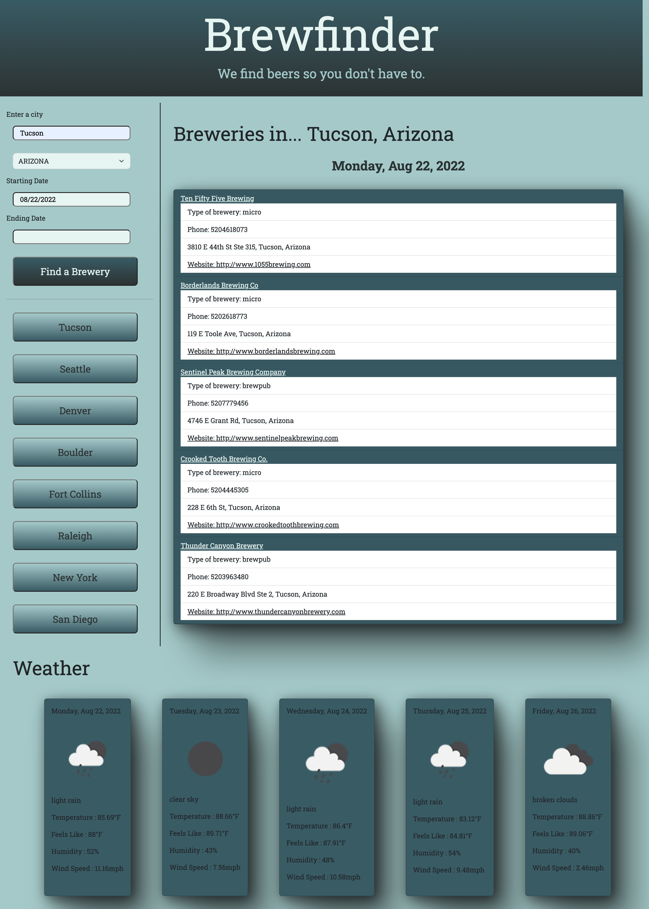

# travel-planner

## About

```
Brewfinder is an app designed to find random local breweries and weather data in any city in the US.
```

## User Story

```
As a user, I want to view random local brewery data along with forecast weather data in the city of my choice so that I can easily find and make plans to experience new breweries wherever I go.
```

## Acceptance Criteria

```
GIVEN I am searching for a local brewery...
WHEN I enter city and state data and click the search button,
THEN I am presented with location and contact information for 5 random breweries in my chosen city.
```

## Screenshot



# Deployed Application

```
https://relero90.github.io/brewfinder/
```

# Technologies Used

Open Brewery Database API:
https://www.openbrewerydb.org/

OpenWeather API:
https://openweathermap.org/api
